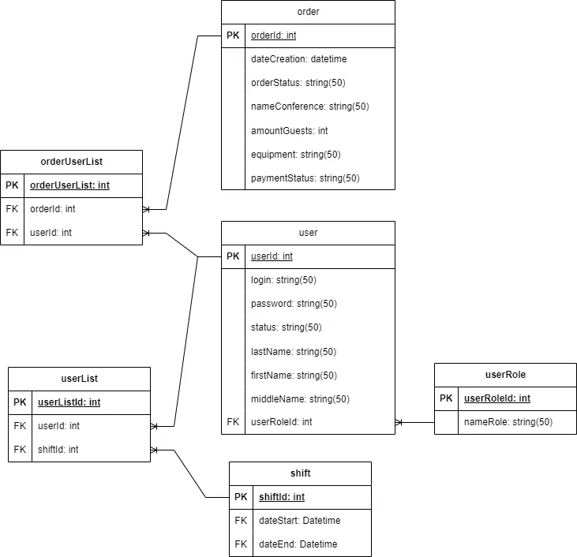

# User Story

| Роль                   | Действие                                          | Цель                                                     |
|------------------------|---------------------------------------------------|----------------------------------------------------------|
| Заведующий подразделением | Регистрация новых пользователей в системе        | Убедиться, что новые сотрудники могут получить доступ к системе и выполнять свои обязанности. |
| Заведующий подразделением | Перевод пользователей в статус «уволен»           | Обновить статус пользователей, которые больше не работают в системе.                          |
| Заведующий подразделением | Назначение техников и организаторов на смены      | Организовать рабочие смены для техников и организаторов, чтобы обеспечить эффективное проведение конференции. |
| Заведующий подразделением | Просмотр всех заказов                             | Получить полный обзор всех текущих и выполненных заказов для контроля и планирования.         |
| Техник                 | Просмотр заказов, принятых от клиентов            | Проверить заказы, назначенные технику, чтобы начать работу над ними.                          |
| Техник                 | Изменение статуса заказа (готовится, готов)       | Обновить статус заказа в системе, чтобы отражать текущий этап выполнения работы.              |
| Организатор            | Создание нового заказа                           | Оформить новый заказ на проведение мероприятия для обеспечения его включения в график конференции. |
| Организатор            | Изменение статуса заказа (принят, не принят)      | Обновить статус заказа, чтобы отразить его текущее состояние и соответствующим образом управлять им. |

# Use Case

| Пользователь                                                    | Система                                                                 |
-----------------------------------------------------------------|-------------------------------------------------------------------------
| Авторизуется                                                    | Отображает соотвествующее окно для пользователя                         |
| Выбирает опцию "Регистрация нового пользователя"                | Отображает форму для ввода данных нового пользователя.                  |
| Вводит данные нового пользователя                               | Сохраняет данные в базе данных и подтверждает успешную регистрацию.     |
| Выбирает опцию "Уволить пользователя"                           | Отображает список активных пользователей для выбора.                    |
| Выбирает пользователя из списка                                 | Изменяет статус выбранного пользователя на «уволен» и обновляет запись. |
| Выбирает опцию "Назначение на смену"                            | Отображает интерфейс для выбора сотрудников и назначения смен.          |
| Выбирает сотрудников и указывает время и дату смены             | Обновляет график смен и уведомляет назначенных сотрудников.             |
| Выбирает опцию "Просмотр заказов"                               | Отображает список всех заказов с их текущими статусами.                 |
| Выбирает опцию "Просмотр заказов"                               | Отображает заказы, назначенные технику.                                 |
| Просматривает список заказов                                    | Позволяет выбрать заказ для изменения статуса.                          |
| Изменяет статус заказа на «готовится» или «готов»               | Обновляет статус заказа и сохраняет изменения в системе.                |
| Выбирает опцию "Создание нового заказа"                         | Отображает форму для ввода деталей нового заказа.                       |
| Вводит детали нового заказа                                     | Сохраняет заказ в базе данных и устанавливает статус на «принят».       |
| Выбирает заказ и изменяет его статус на «принят» или «не принят» | Обновляет статус заказа и сохраняет изменения в системе.                |

## User case

## Wireframe

## ERD

# Тесты

### Тестовый сценарий #1

| Критерий | Значение |
|----------|---------|
| Тестовый сценарий # | TC_SC_1 |
| Приоритет тестирования | высокий |
| Заголовок/название теста | Создание нового заказа на выступление |
| Краткое изложение теста | Организатор должен успешно создать новый заказ на выступление в системе |
| Этапы теста | 1. Войти в систему как организатор 2. Перейти к форме создания нового заказа 3. Заполнить необходимые поля (название конференции, количества гостей, оборудование) 4. Сохранить новый заказ |
| Тестовые данные | Название конференции: *Конференция по программированию* Количество гостей: *50* Оборудование: *презентационный экран и микрофон* |
| Ожидаемый результат | Новый заказ должен быть успешно создан и отображаться в списке заказов |
| Фактический результат | Новый заказ создан и отображается корректно |
| Статус | зачет |
| Предварительное условие | Система должна быть заполнена данными о сотрудниках и сменах |
| Постусловие | Новый заказ должен отображаться в списке заказов организатора |
| Примечания/комментарии | Проверить, что все поля заполняются корректно и сохраняются без ошибок |

### Тестовый сценарий #2

| Критерий | Значение |
|----------|---------|
| Тестовый сценарий # | TC_SC_2 |
| Приоритет тестирования | средний |
| Заголовок/название теста | Изменение статуса заказа на "готовится" |
| Краткое изложение теста | Техник должен успешно изменить статус заказа на "готовится" в системе |
| Этапы теста | 1. Войти в систему как техник 2. Перейти к списку заказов 3. Выбрать конкретный заказ 4. Нажать кнопку изменения статуса 5. Выбрать новый статус "готовится" 6. Сохранить изменения |
| Тестовые данные | ID заказа: *ORD001* |
| Ожидаемый результат | Статус заказа должен быть изменен на "готовится" и отображаться корректно |
| Фактический результат | Статус заказа изменен на "готовится" и отображается правильно |
| Статус | зачет |
| Предварительное условие | Система должна содержать список заказов и возможность их редактирования |
| Постусловие | Изменения должны сохраниться и отображаться при просмотре заказа |
| Примечания/комментарии | Проверить, что изменение статуса не влияет на другие параметры заказа |

### Тестовый сценарий #3

| Критерий | Значение |
|----------|---------|
| Тестовый сценарий # | TC_SC_3 |
| Приоритет тестирования | низкий |
| Заголовок/название теста | Регистрация нового сотрудника в системе |
| Краткое изложение теста | Заведующий подразделением должен успешно зарегистрировать нового сотрудника в системе |
| Этапы теста | 1. Войти в систему как заведующего подразделения 2. Перейти к форме регистрации новых пользователей 3. Заполнить необходимые поля (имя, фамилия, должность) 4. Выбрать статус регистрации 5. Сохранить нового сотрудника |
| Тестовые данные | Имя: *Иван* Фамилия: *Петров* Должность: *Сотрудник отдела конференций* Статус: *активный* |
| Ожидаемый результат | Новый сотрудник должен быть успешно добавлен в систему и отображаться в списке пользователей |
| Фактический результат | Новый сотрудник добавлен и отображается в списке пользователей |
| Статус | зачет |
| Предварительное условие | Система должна содержать форму регистрации новых пользователей |
| Постусловие | Нового сотрудника должно быть видно в списке всех пользователей системы |
| Примечания/комментарии | Проверить, что все поля заполняются корректно и сохраняются без ошибок |