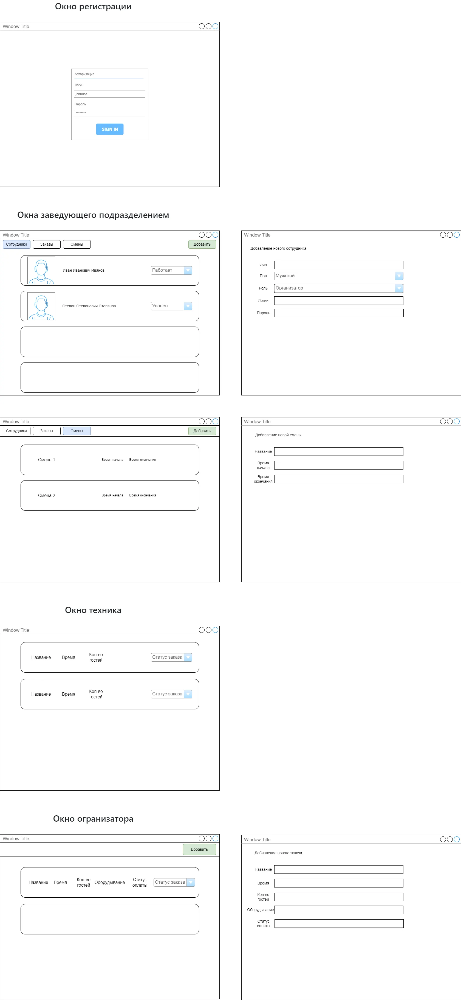

# User Story

| Роль                   | Действие                                          | Цель                                                     |
|------------------------|---------------------------------------------------|----------------------------------------------------------|
| Заведующий подразделением | Регистрация новых пользователей в системе        | Убедиться, что новые сотрудники могут получить доступ к системе и выполнять свои обязанности. |
| Заведующий подразделением | Перевод пользователей в статус «уволен»           | Обновить статус пользователей, которые больше не работают в системе.                          |
| Заведующий подразделением | Назначение техников и организаторов на смены      | Организовать рабочие смены для техников и организаторов, чтобы обеспечить эффективное проведение конференции. |
| Заведующий подразделением | Просмотр всех заказов                             | Получить полный обзор всех текущих и выполненных заказов для контроля и планирования.         |
| Техник                 | Просмотр заказов, принятых от клиентов            | Проверить заказы, назначенные технику, чтобы начать работу над ними.                          |
| Техник                 | Изменение статуса заказа (готовится, готов)       | Обновить статус заказа в системе, чтобы отражать текущий этап выполнения работы.              |
| Организатор            | Создание нового заказа                           | Оформить новый заказ на проведение мероприятия для обеспечения его включения в график конференции. |
| Организатор            | Изменение статуса заказа (принят, не принят)      | Обновить статус заказа, чтобы отразить его текущее состояние и соответствующим образом управлять им. |

# Use Case

Пользователь | Система
--|--
Авторизуется | Отображает соотвествующее окно для пользователя
Выбирает опцию "Регистрация нового пользователя"        | Отображает форму для ввода данных нового пользователя.                   
Вводит данные нового пользователя                      | Сохраняет данные в базе данных и подтверждает успешную регистрацию.      
Выбирает опцию "Уволить пользователя"                  | Отображает список активных пользователей для выбора.                     
Выбирает пользователя из списка                        | Изменяет статус выбранного пользователя на «уволен» и обновляет запись.  
Выбирает опцию "Назначение на смену"                   | Отображает интерфейс для выбора сотрудников и назначения смен.           
Выбирает сотрудников и указывает время и дату смены    | Обновляет график смен и уведомляет назначенных сотрудников.             
Выбирает опцию "Просмотр заказов"                      | Отображает список всех заказов с их текущими статусами.  
Выбирает опцию "Просмотр заказов"                      | Отображает заказы, назначенные технику.
Просматривает список заказов                                | Позволяет выбрать заказ для изменения статуса.
Изменяет статус заказа на «готовится» или «готов»           | Обновляет статус заказа и сохраняет изменения в системе.
Выбирает опцию "Создание нового заказа"                      | Отображает форму для ввода деталей нового заказа.
Вводит детали нового заказа                                | Сохраняет заказ в базе данных и устанавливает статус на «принят».
Выбирает заказ и изменяет его статус на «принят» или «не принят» | Обновляет статус заказа и сохраняет изменения в системе.

## User case

## Wireframe
